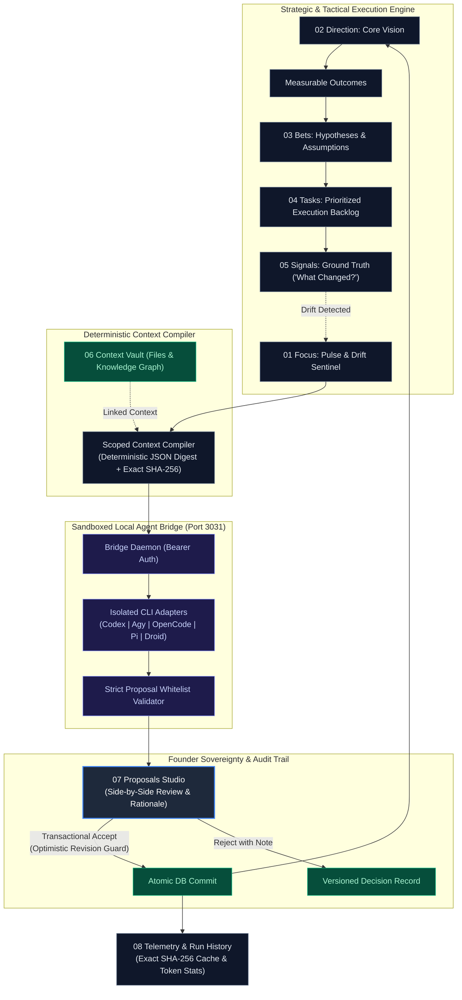

# ⚡ Nerve — Solo-Founder Vision-to-Execution OS

<p align="center">
  
  
  
  
  
  
  
</p>

---

## 🎯 Executive Overview

**Nerve** is an opinionated, local-first **Vision-to-Execution Operating System** designed specifically for the **solo technical founder**.

Founding a technology venture alone demands operating simultaneously across three distinct cognitive altitudes:
1. **High Altitude (Strategic Vision & Bets):** Framing hypotheses, defining measurable quarterly outcomes, and questioning assumptions.
2. **Low Altitude (Daily Tactical Execution):** Shipping high-leverage tasks, meeting hard deadlines, and eliminating blockers without cognitive friction.
3. **Ground Truth (Market Reality Signals):** Capturing customer feedback, unexpected bugs, market shifts, and usage telemetry before they undermine strategy.

Most tools either reduce founders to reactive task-list managers (Todoist/Linear) or bloat into sprawling, ungrounded knowledge wikis (Notion/Obsidian). **Nerve closes the feedback loop between strategy, execution, and reality** — reinforced by a deterministic calculation engine and a sandboxed, founder-supervised local AI agent bridge.

---

## 📐 Core Principles & First Principles

| Principle | Nerve Philosophy |
|:---|:---|
| **Jobs, Not Personas** | No roleplaying chatbots, artificial teammates, or infinite conversational rabbit holes. Nerve invokes scoped, one-shot analytical jobs: `clarify-vision`, `challenge-bet`, `assess-signal`, `replan-work`, and `weekly-review`. |
| **Deterministic Core First** | The entire system is 100% operational with **zero AI CLIs installed**. Prioritization, drift detection, deadline alerts, entity linkage, token accounting, and cache verification are purely deterministic. |
| **Founder Sovereignty** | Untrusted AI models never mutate your operational state autonomously. Agents only generate structured **Proposals**. The founder inspects exact JSON diffs and executes transactional **Accept** or **Reject** decisions with immutable audit trails. |
| **Local-First & Data Ownership** | Zero cloud telemetry leaks. Runs strictly on local loopback (`127.0.0.1`). Ships with an embedded PostgreSQL 16 WASM engine ([PGlite](https://github.com/electric-sql/pglite)) with zero external dependencies, or seamlessly binds to any existing PostgreSQL cluster. |
| **Hardened CLI Trust Boundaries** | Local agents execute through an isolated bridge daemon (`src/bridge/bridge.ts`) running ephemeral sandboxes (`--sandbox read-only`, `--pure`, isolated directories), allowlist-filtered flags, scrubbed environments, and strict output whitelist schemas. |

---

## 🔄 The Closed-Loop Architecture

Nerve establishes a perpetual, self-correcting strategic flywheel:



---

## 🖥️ Command Center Modules

Nerve organizes the solo founder's operational reality into **10 dedicated command surfaces**:

```
01 Focus       ─ Real-time pulse, next action queue, drift radar, and 14-day horizon
02 Direction   ─ Living North Star vision and quarterly measurable outcomes
03 Bets        ─ Strategic hypotheses, stated assumptions, and review dates
04 Tasks       ─ Deterministic execution queue (p0–p3, blocking states, deadlines)
05 Signals     ─ Sensory radar for customer quotes, metrics, and empirical events
06 Vault       ─ Hierarchical knowledge graph & context file storage
07 Proposals   ─ Two-panel proposal review studio with atomic transactional commit
08 Runs        ─ Agent execution telemetry, latency tracking, and SHA-256 cache hits
09 MCP Tools   ─ Model Context Protocol server catalog and tool inspection
10 Settings    ─ Agent Bridge diagnostics, CLI detection, model overrides, and limits
```

### `01 Focus (/` — The Default Operating Room)
- **Founder Pulse**: Instant metrics tracking Active Outcomes, Pending Proposals, Open Backlog Tasks, and Today's Signals.
- **Deterministic Next Actions**: Eliminates decision fatigue by ordering work strictly: `Overdue Tasks` ➔ `Soonest Deadline` ➔ `Priority (p0 > p1 > p2 > p3)`.
- **Drift Sentinel**: Continuously detects and flags unlinked tasks, stale strategic bets, low-confidence outcomes, and approaching deadlines.
- **14-Day Horizon Radar**: Visualizes upcoming commitments across a rolling two-week window.
- **Frictionless Capture**: Add high-priority tasks and toggle completion or blocked states with a single click.
- **Fast Agent Job Dispatch**: Trigger targeted strategic reviews directly from the command center.

### `02 Direction (/direction` — North Star & Measurable Outcomes)
- **Versioned Vision**: Maintain an immutable, auditable record of the company's core mission, market thesis, and high-level strategy.
- **Quarterly Outcomes**: Track measurable outcomes with real-time confidence scores (`low`, `medium`, `high`), status (`active`, `done`, `archived`), and target dates.

### `03 Bets (/bets` — Strategic Hypotheses & Assumptions)
- **Explicit Assumptions**: Every significant initiative is formulated as a testable bet linked to a specific outcome.
- **Hypothesis Tracking**: Documents the core rationale, stated assumptions, confidence ratings, and mandatory review dates (`open`, `supported`, `refuted`).

### `04 Tasks (/tasks` — High-Velocity Execution)
- **Priority Matrix**: Filter and execute tasks categorized by `p0` (existential/critical), `p1` (high impact), `p2` (standard), or `p3` (backlog).
- **Hard Deadlines & Blocking Indicators**: Pinpoints exactly which work items are blocked and highlights overdue dependencies.
- **Outcome & Bet Linkage**: Prevents busywork by ensuring tactical items tie back to strategic goals.

### `05 Signals (/signals` — Reality Radar: "What Changed?")
- **Empirical Feedback Loop**: Rapid intake for customer feedback, metrics, unexpected technical hurdles, or competitor movements.
- **Classification**: Tag signals by kind (`note`, `metric`, `quote`, `event`) and connect them directly to affected bets and outcomes.

### `06 Vault (/vault` — Context Vault & Knowledge Graph)
- **Hierarchical Knowledge Storage**: Store specifications, architecture blueprints, research briefs, and session transcripts.
- **Entity Linking**: Connect vault nodes to visions, outcomes, bets, tasks, and signals using typed relations (`evidence`, `specification`, `context`, `deliverable`, `reference`).
- **Context Injection**: Flag specific nodes to automatically be compiled into agent context packets for contextual precision.

### `07 Proposals (/proposals` — Proposal Review Studio)
- **Sovereign Review Interface**: Inspect agent recommendations, detailed rationale, supporting citations, and affected entities.
- **Exact JSON Diff Inspection**: View every proposed database mutation (`create`, `update`) before it touches production.
- **Transactional Accept**: Applies all updates atomically within a database transaction while validating `expectedRevision` to prevent stale writes.
- **Audited Reject**: Reject proposals with custom feedback notes, stored permanently in the `decisions` audit ledger.

### `08 Runs & Telemetry (/runs` — Observability & Cache Performance)
- **Execution Telemetry**: Complete audit history of every agent job run with status (`ok`, `cache_hit`, `error`, `unavailable`).
- **Exact SHA-256 Cache Engine**: Reuses previous results instantly when the underlying domain entities and prompt templates remain unchanged.
- **Token Accounting & Latency**: Monitors estimated token expenditure and execution duration per adapter.

### `09 MCP Tools (/mcp` — Model Context Protocol)
- **Tool Protocol Catalog**: Register and monitor local and remote MCP servers across standard transports (`stdio`, `sse`, `streamable_http`).
- **Discovery**: Real-time tool introspection and schema caching.

### `10 Settings (/settings` — Bridge Diagnostics & Infrastructure)
- **Live Bridge Daemon Probe**: Checks health, latency, port allocation, and authorization tokens for the local agent bridge.
- **CLI Adapter Detection**: Automatically probes host binaries for `codex`, `agy`, `opencode`, `pi`, and `droid`.
- **Customizable Boundaries**: Set custom execution timeouts, token limits, and model overrides per adapter.

---

## 🛡️ Local Agent Bridge & CLI Adapters

Nerve interfaces with local agent CLIs via a dedicated, authenticated bridge daemon (`src/bridge/bridge.ts`) running on loopback (`127.0.0.1:3031`).

```
                ┌───────────────────────────────────────┐
                │          Nerve Web App (Next.js)      │
                │        http://127.0.0.1:3000          │
                └───────────────────┬───────────────────┘
                                    │ HTTP (Bearer Token)
                                    ▼
                ┌───────────────────────────────────────┐
                │      Nerve Local Agent Bridge Daemon  │
                │        http://127.0.0.1:3031          │
                └───────────────────┬───────────────────┘
                                    │ Spawn subprocess (Argv array, no shell)
                                    ▼
        ┌──────────────┬──────────────┬──────────────┬──────────────┬──────────────┐
        │    codex     │     agy      │   opencode   │      pi      │    droid     │
        │   0.153.4    │    1.1.17    │   1.18.31    │    0.85.1    │   0.221.0    │
        └──────────────┴──────────────┴──────────────┴──────────────┴──────────────┘
```

### Verified CLI Invocation & Sandbox Profiles

All adapters execute strictly via `argv` arrays (never passed through a shell interpreter). Missing CLIs are cleanly detected via `--version` probes and surfaced in the UI without halting execution.

| Adapter | Verified Safe Invocation | Isolation & Safety Flags |
|:---|:---|:---|
| **Codex** | `codex exec --sandbox read-only --skip-git-repo-check --ephemeral --output-schema F --json <prompt>` | Read-only sandbox, ephemeral instance, parsed from JSONL. |
| **Agy** | `agy -p --mode plan --sandbox --output-format json --json-schema F <prompt>` | Plan mode, strict sandbox, structured JSON schema output. |
| **OpenCode** | `opencode run --pure --format json --dir <isolated-tmp-dir> <prompt>` | Pure mode, isolated temp workspace, never `--auto`. |
| **Pi** | `pi -p --mode json --no-session --no-tools --no-extensions --no-skills --no-context-files <prompt>` | Ephemeral session, zero tools/extensions/skills/context files. |
| **Droid** | `droid exec --output-format json --disable-builtin-skills --cwd <isolated-tmp-dir> <prompt>` | Read-only by default, disabled builtin skills, isolated workspace. |

### Security Trust Boundaries
1. **No Auto-Approval Bypasses**: Flags like `--approve-for-me`, `--dangerously-skip-permissions`, `--auto`, or `--skip-permissions-unsafe` are strictly prohibited.
2. **Environment Scrubbing**: The child process environment drops all `NERVE_*` environment variables and host credentials, retaining only allowlisted provider API keys necessary for CLI execution.
3. **Isolated Working Directory**: Each run operates within an ephemeral temporary directory (`jobdir-*`) that is cleaned up automatically upon completion.
4. **Untrusted Stdout Boundary**: Stdout is parsed per-adapter and validated against a strict JSON schema (`src/lib/validate.ts`). Only authorized entities (`vision`, `outcome`, `bet`, `task`), valid operations (`create`, `update`), and allowed fields pass validation.
5. **Revision Guard**: Updates must specify an `expectedRevision`. If an entity was modified since the context packet was generated, the entire transaction is rejected to prevent race conditions.

---

## ⚡ Tech Stack & Architecture

- **Runtime:** [Bun](https://bun.sh) (Strictly Bun — fast, native TypeScript execution, zero npm/npx).
- **Full-Stack Framework:** [Next.js 16](https://nextjs.org) with Turbopack, App Router, React 19, and Server Components.
- **Database Engine:** Dual-mode PostgreSQL:
  - *Embedded Mode (Default):* [PGlite](https://github.com/electric-sql/pglite) (PostgreSQL 16 compiled to WASM with local filesystem persistence in `./nerve-pgdata`).
  - *Server Mode (Production/Shared):* External PostgreSQL pool via `pg` (`DATABASE_URL` / `POSTGRES_URL`).
- **Styling & UI:** [Tailwind CSS v4](https://tailwindcss.com), [Radix UI Primitives](https://www.radix-ui.com), and [Lucide Icons](https://lucide.dev).
- **Testing & Quality Assurance:** Bun Test runner and [Playwright](https://playwright.dev) headless browser E2E test suites.

---

## 🚀 Quickstart Guide

### 1. Prerequisites
Ensure you have **Bun** (v1.2.0 or newer) installed:
```sh
bun --version
```

### 2. Clone and Install Dependencies
```sh
git clone https://github.com/g2m7/nerve.git
cd nerve
bun install
```

### 3. Configure Environment
Copy the example environment file:
```sh
cp .env.example .env
```
*(By default, Nerve binds to `127.0.0.1` and uses embedded PGlite storage in `./nerve-pgdata`. No external database setup required.)*

### 4. Start the Application
Open two terminal windows (or run in background):

**Terminal 1 — Next.js Web Interface:**
```sh
bun run dev
```
*(Access the Command Center at **http://localhost:3000**)*

**Terminal 2 — Local Agent Bridge Daemon:**
```sh
bun run bridge
```
*(Starts the Agent Bridge daemon on **http://127.0.0.1:3031**)*

---

## 🛠️ Development & Operational Scripts

| Command | Description |
|:---|:---|
| `bun run dev` | Starts the Next.js 16 development server with Turbopack on `http://127.0.0.1:3000`. |
| `bun run bridge` | Starts the Bun-powered Local Agent Bridge Daemon on `http://127.0.0.1:3031`. |
| `bun run typecheck` | Executes strict TypeScript type validation (`tsc --noEmit`). |
| `bun run build` | Compiles the production Next.js build using Turbopack. |
| `bun run start` | Serves the optimized production build. |
| `bun test` | Executes the unit test suite across db, prioritize, context, and validate logic. |
| `bun run tests/browser-verification.ts` | Runs Playwright end-to-end browser verification against the command center. |

---

## ⚙️ Configuration Reference (`.env`)

| Variable | Default | Description |
|:---|:---|:---|
| `PORT` | `3000` | Port for the Next.js web application. |
| `HOST` | `127.0.0.1` | Loopback IP address binding. |
| `NERVE_PG_DIR` | `./nerve-pgdata` | File path for the embedded PostgreSQL (PGlite) database. |
| `DATABASE_URL` | *(None)* | Optional PostgreSQL connection string for connecting to an external DB cluster. |
| `NERVE_BRIDGE_PORT` | `3031` | Port for the Local Agent Bridge daemon. |
| `NERVE_BRIDGE_TOKEN` | `nrv_live_bridge_secret` | Bearer token for authenticating requests between the web app and agent bridge. |
| `NERVE_AGENT_TIMEOUT_MS` | `120000` | Maximum subprocess execution time for CLI agents (120 seconds). |
| `NERVE_AGENT_MAX_OUTPUT` | `262144` | Maximum stdout buffer cap for CLI responses (256 KB). |
| `NERVE_<ADAPTER>_BIN` | *(PATH default)* | Custom executable binary path for a specific CLI adapter (e.g. `NERVE_CODEX_BIN`). |
| `NERVE_<ADAPTER>_MODEL` | *(Adapter default)* | Model override passed to a specific adapter (e.g. `NERVE_CODEX_MODEL`). |

---

## 📂 Repository Structure

```
nerve/
├── .agents/                    # Agent skills specifications
├── .env.example                # Example environment configuration
├── .gitignore                  # Git ignore rules (ignoring .next, nerve-pgdata, builds)
├── AGENTS.md                   # Agent bridge architecture specification
├── product.md                  # Product architecture & UX specification
├── package.json                # Project dependencies and script definitions
├── bun.lock                    # Bun dependency lockfile
├── tsconfig.json               # TypeScript strict configuration
├── next.config.ts              # Next.js configuration
├── postcss.config.mjs          # PostCSS & Tailwind v4 plugin configuration
├── components.json             # Radix / shadcn UI configuration
│
├── src/
│   ├── app/                    # Next.js App Router
│   │   ├── api/                # API routes (bets, outcomes, tasks, signals, vault, mcp, runs)
│   │   ├── bets/               # Strategic Bets management surface
│   │   ├── direction/          # Vision and Measurable Outcomes
│   │   ├── mcp/                # Model Context Protocol management
│   │   ├── proposals/          # Proposal Review & Decision Engine
│   │   ├── runs/               # Agent Runs Telemetry & History
│   │   ├── settings/           # Bridge & Adapter configuration
│   │   ├── signals/            # Reality Signals intake
│   │   ├── tasks/              # Tactical task backlog
│   │   ├── vault/              # Context Vault & Knowledge Graph
│   │   ├── globals.css         # Tailwind v4 theme definitions
│   │   ├── layout.tsx          # Root shell layout with 10-module navigation
│   │   └── page.tsx            # 01 Focus Command Center
│   │
│   ├── bridge/
│   │   └── bridge.ts           # Bun-powered Local Agent Bridge HTTP Daemon
│   │
│   ├── components/             # Reusable UI components
│   │   ├── ui/                 # Radix UI primitives (buttons, cards, badges, tabs, etc.)
│   │   └── BridgeStatusBadge.tsx # Real-time bridge health indicator
│   │
│   ├── lib/                    # Core business logic & database layer
│   │   ├── db/
│   │   │   ├── index.ts        # Dual-engine PostgreSQL client (PGlite WASM / Pool)
│   │   │   ├── migrate.ts      # PostgreSQL migration runner
│   │   │   └── repos.ts        # Strongly-typed database repositories
│   │   ├── api-helper.ts       # Standardized Next.js route handlers
│   │   ├── bridge-client.ts    # Client helper for bridge communication
│   │   ├── context.ts          # Scoped context compiler & SHA-256 cache engine
│   │   ├── prioritize.ts       # Deterministic prioritization & drift detection
│   │   ├── proposals.ts        # Transactional proposal apply & rejection logic
│   │   ├── types.ts            # Centralized TypeScript domain types
│   │   ├── utils.ts            # Formatting & utility helpers
│   │   └── validate.ts         # Strict proposal whitelist schema validation
│   │
│   └── agents/                 # CLI adapter definitions & subprocess runners
│       ├── adapters.ts         # Adapter command builders, arg filters, and stdout parsers
│       └── runner.ts           # Local execution runner and cache orchestrator
│
└── tests/                      # Verification test suites
    ├── browser-verification.ts # Playwright E2E browser verification
    ├── adapters.test.ts        # CLI adapter arg safety & sandbox tests
    ├── context.test.ts         # Context compiler & cache tests
    ├── db.test.ts              # Migration & repository tests
    ├── prioritize.test.ts      # Deterministic sorting tests
    └── proposals.test.ts       # Transactional apply & stale-guard tests
```

---

## 🔒 Security & Privacy Notice

> [!IMPORTANT]
> **Nerve is strictly designed to run on local loopback (`127.0.0.1`).**
> - The application includes **no multi-user authentication** in this MVP.
> - **Do not expose ports 3000 or 3031 to public networks, proxies, or shared LAN environments.**
> - All operational records, strategic hypotheses, and context documents are stored locally on your machine.
> - Agent CLI processes run with allowlisted arguments and scrubbed environments, but depend on your host CLI permissions. Install only trusted CLIs and review their respective execution profiles.

---

## 📄 License & Credits

Built for founders who build. Released under the [MIT License](LICENSE).
